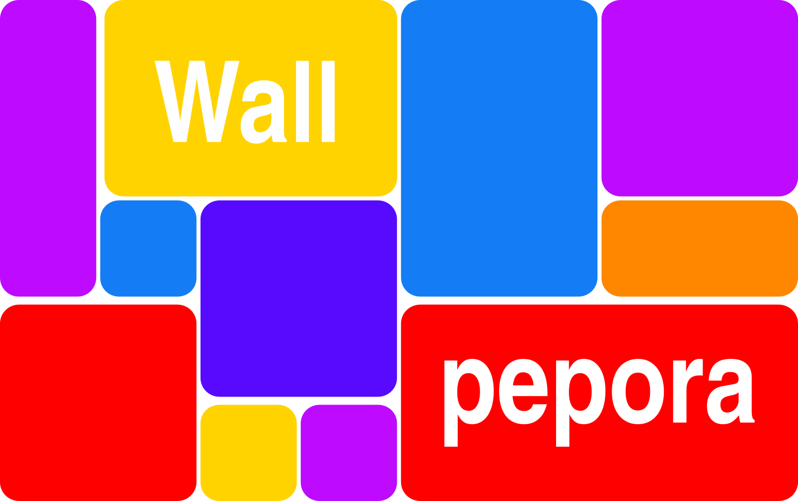

# Wallpepora
Wallpepora is a C++ desktop application to make grid squares collages of images creation easier. It works on Linux OS but if you want it to works on
others OS you need to compile it yourself.

# Install and run 
## Install
To install the application, you just need to decompress the tar.gz archive where you want.

## Run
The default interface of the application is the GUI. To run it, run the executable :

    ./wallpepora

To run the application with the CLI, run the executable with the option **--no-gui** :

    ./wallpepora --no-gui

You may need to give the permissions to run the executable, you can do it by running the command :

    chmod a+x wallpepora

# Depedencies

* [wxWidgets 3.2.5 - to create the GUI](https://github.com/wxWidgets/wxWidgets)

* [OpenCV 4.9.0 - for the images processing and collages creation](https://github.com/opencv/opencv)

* [Google Test - for writing application's tests](https://github.com/google/googletest)

# Compilation

To compile the project, use CMake, there is already a CMakeLists.txt to compile the project in the source code.

    mkdir build
    cd build
    cmake ..
    make

# CLI commands
This section presents the commands supported by the CLI.

|Command | Description|
| --- | ---- |
|exit | Exits the program |
|load (files \|\| directories) | loads new images |
|delete imgId | deletes an image using its id |
|delete --all | deletes all images |
|set -r value| Updates the grid's number of rows |
|set --rows=value | Updates the grid's number of rows |
|set -c value | Updates the grid's number of cols |
|set --cols=value | Updates the grid's number of cols |
|set -s value | Updates the grid's cells' size |
|set --size=value | Updates the grid's cells' size |
|show -g | Shows the grid's current state in a window |
|show --grid | Shows the grid's current state in a window |
|show -i | Shows the list of loaded images |
|show --images| Shows the list of loaded images |
|show -t | Show the list of the tiles on the grid |
|show --tiles | Show the list of the tiles on the grid |
|show -w id | Shows a wallpaper in a window using its id |
|show --wallpaper=id | Shows a wallpaper in a window using its id |
|show -w | Shows the list of wallpapers ids |
|show --wallpapers | Shows the list of wallpapers ids |
|merge rowMin colMin rowMax colMax | Merges the rectangle of cells determinated by the coordinnates |
|unmerge tileId | Destroys a tile using its id |
|place row col imgId | Places an image in a cell or a tile |
|place tileId imgId | Places an image in a tile |
|remove row col | Removes the image contained in a cell or a tile |
remove tileId | Removes the image contained in a tile |
|fill | Fills the empty cells and tiles with images randomly |
|fill --hard | Fills the cells and tiles with images randomly, even the ones which already contain an image |
|generate | Generates a new wallpaper if possible |
|export id filepath | Exports a wallpaper using its id |
|reset | Resets the grid (removes the tiles and the images) |